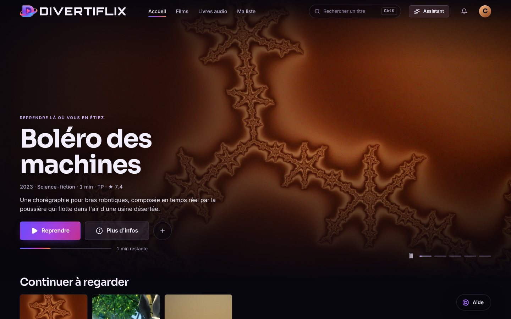
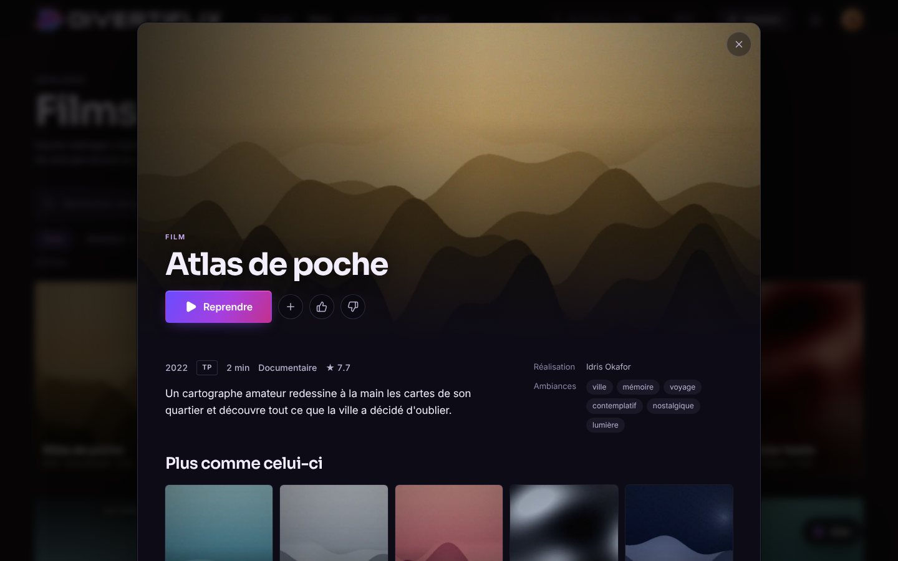
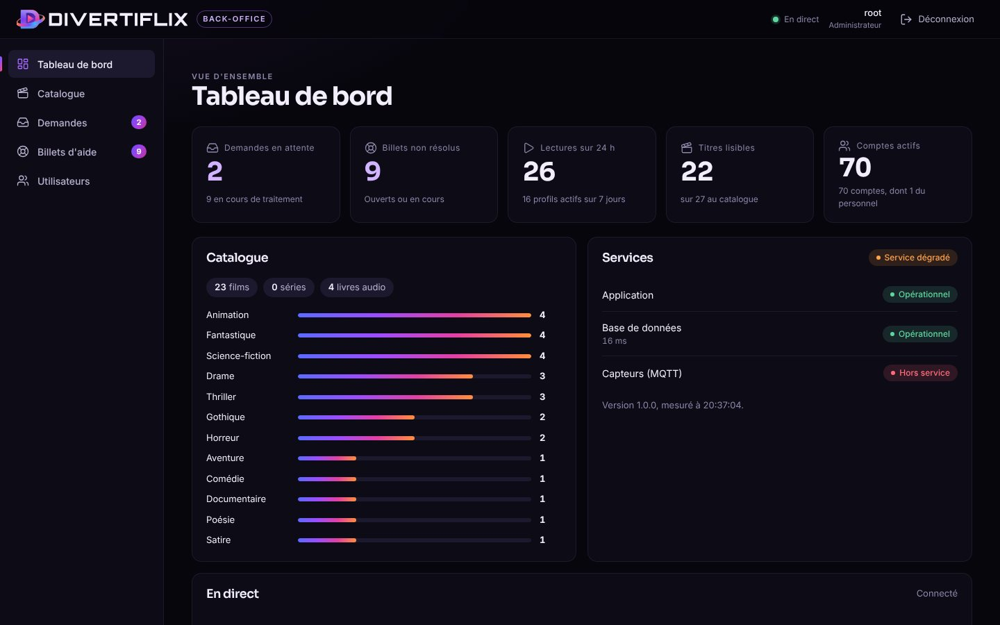
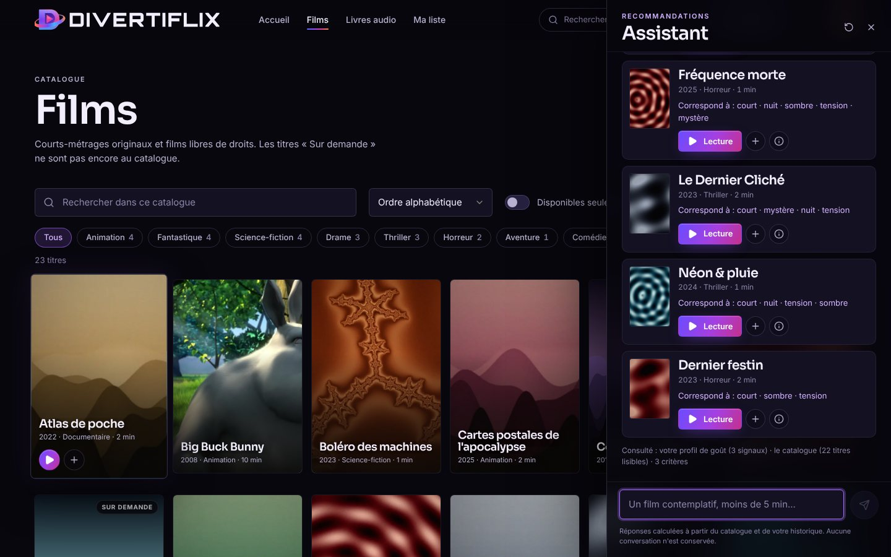
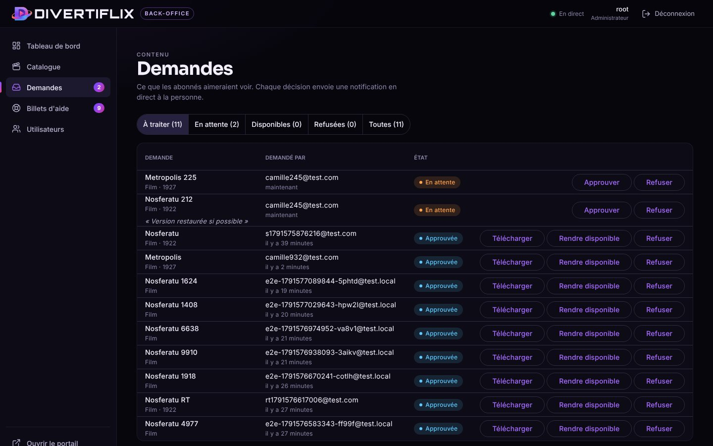

# Divertiflix

Plateforme de vidéo sur demande de l'entreprise fictive Divertiflix (cours 420-511-SH, Cégep de Sherbrooke). Un portail pour les
abonnés, un back-office pour le personnel, une API, et un moteur de recommandation expliquable. Tout fonctionne de bout en bout :
aucune fonction n'est factice.



## Ce que ça fait

**Portail abonné** (React) : accueil personnalisé (à la une, reprise de lecture, « parce que vous avez regardé », tendances,
nouveautés), films et livres audio avec filtres, fiche de titre, lecteur HLS avec reprise, lecteur audio persistant pendant la
navigation, liste personnelle, pouces haut et bas, profils multiples, palette de commandes (Ctrl+K), assistant de recommandation,
demande de titre, aide avec fil de discussion, notifications en direct, français et anglais.

**Back-office** (Angular) : tableau de bord (compteurs, état des services, flux en direct), catalogue complet, demandes
(approuver, télécharger, rendre disponible, refuser avec raison), billets d'aide (réponse depuis le fil), utilisateurs (rôles,
activation). Deux rôles : Admin (tout) et Support (lecture, réponses aux billets).

**API** (ASP.NET Core 9) : authentification JWT avec jetons de rafraîchissement à usage unique, recommandations, assistant,
demandes, billets, notifications SignalR, synchronisation Active Directory et Audiobookshelf, médias servis par URL signées,
pont MQTT vers les capteurs ESP32.

| Portail | Back-office |
| --- | --- |
|  |  |
|  |  |

## Démarrage rapide (développement)

Prérequis : .NET 9, Node 22.22 ou plus, Docker.

```bash
docker compose up -d                       # PostgreSQL, Mosquitto, Redis (ports sur 127.0.0.1)
npm install
cd apps/api && ASPNETCORE_ENVIRONMENT=Development dotnet run --project src/Divertiflix.Api --urls http://localhost:5080
npm run web                                # portail : http://localhost:5173
npm start -w admin-angular                 # back-office : http://localhost:4200
```

Compte administrateur de développement : `root` / `boom123$` (n'existe qu'en développement : hors développement,
`Seed__AdminPassword` est obligatoire). Un abonné se crée depuis l'écran d'inscription du portail.

`./start-all.sh` lance tout d'un coup, `./stop-all.sh` l'arrête.

## Tests

| Suite | Commande | Contenu |
| --- | --- | --- |
| API (xUnit) | `cd apps/api && dotnet test` | 117 tests : moteur, analyseur de requêtes, accueil, assistant, flux de travail, sécurité, temps réel. Base PostgreSQL jetable par classe. |
| Portail (Vitest) | `npm test` | 44 tests : clés de traduction, client API, composants. |
| Back-office (Angular) | `cd apps/admin-angular && npx ng test --watch=false` | 24 tests. |
| Bout en bout (Playwright) | `E2E_CHROME=/chemin/chrome npm run e2e` | 14 parcours réels sur la pile complète, dont les notifications en direct entre portail et back-office. |

Les parcours de bout en bout demandent l'API, PostgreSQL et un Chrome capable de lire le H.264 (le Chromium de Playwright ne le lit
pas). Pour les lancer à répétition, relever les plafonds de débit : `RateLimit__AuthPerMinute=100000`.

## Organisation du dépôt

```
apps/api/            API .NET (Domain, Infrastructure, Api, Tests)
apps/web-react/      portail abonné
apps/admin-angular/  back-office
packages/api-client/ types et client générés depuis l'OpenAPI, partagés par les deux fronts
packages/brand/      logo (SVG) et jetons de design partagés
packages/demo/       faux serveur en TypeScript pour la démo hébergée (sans API)
tools/demo-media/    génération des médias de démonstration (ffmpeg)
tools/brand/         génération du logo et des icônes
tools/recsys-eval/   évaluation du moteur sur MovieLens
e2e/                 parcours Playwright
infra/               configuration Mosquitto
docs/                architecture, sécurité, recommandation, démonstration, captures
```

## Documentation

- [Architecture](docs/architecture.md) : composants, flux, décisions.
- [Sécurité](docs/securite.md) : ce qui est protégé, comment, et ce qui reste à faire.
- [Recommandation](docs/recommandation.md) : le moteur, l'assistant, et son [évaluation sur MovieLens](docs/evaluation-movielens.md).
- [Démonstration](docs/demo.md) : déroulé de 7 minutes.
- [Démo hébergée](docs/demo-hebergee.md) : portail et back-office jouables dans le navigateur, sans serveur.
- `memoire.md` : décisions et pièges rencontrés. `logiciels.md` : tout ce qui est installé. `progres.md` : avancement.

## Déploiement

`sudo ./install-serveur.sh` sur un Ubuntu 22.04 ou 24.04 (idempotent : le relancer redéploie). Il installe les dépendances, génère
les secrets dans `/opt/divertiflix/.env` (permissions 600), démarre l'infrastructure, compile l'API et les deux fronts, configure le
service systemd durci et nginx (en-têtes de sécurité, CSP stricte, cache des fichiers à empreinte, WebSocket pour le temps réel).
Avec `DOMAIN` et `CERTBOT_EMAIL`, HTTPS Let's Encrypt est configuré. Le pipeline GitLab exécute les tests avant tout déploiement.

## Contenus de démonstration et licences

Les affiches, fonds, courts-métrages et livres audio du catalogue de démonstration sont **générés** par `tools/demo-media`
(images génératives, vidéos et voix de synthèse produites avec ffmpeg) : aucune œuvre protégée n'est incluse. « Big Buck Bunny »
est © Blender Foundation, licence CC BY 3.0 (crédit affiché sur sa fiche). Les textes des livres audio sont du domaine public.
Le jeu de données MovieLens, utilisé uniquement pour l'évaluation, n'est pas versionné (GroupLens Research, Université du Minnesota).

## Identité visuelle

Le logo officiel est dans `packages/brand` (SVG, fond transparent) ; les jetons de couleur, de police et de mouvement y sont aussi,
et alimentent le portail et le back-office : une seule source. Voir `packages/brand/README.md`.
